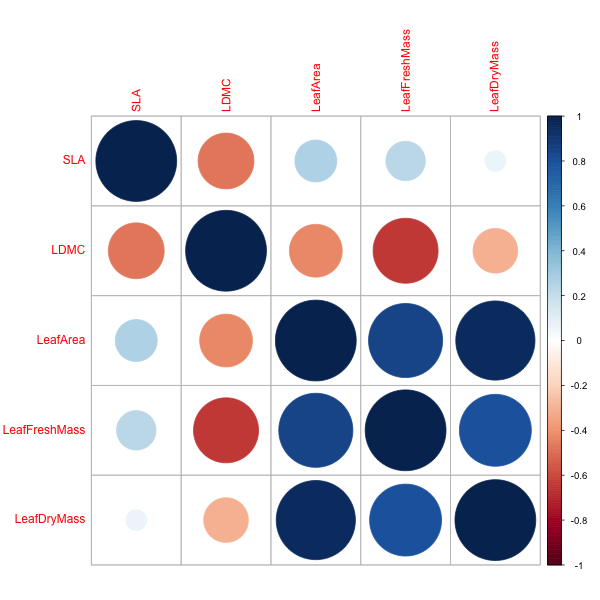

### Tutorial Aims

#### <a href="#section1"> 1. Create a trait-trait correlation plot</a>

#### <a href="#section2"> 2. Convert wide data to long format for summarising and graphing</a>

#### <a href="#section3"> 3. Make a more detailed trait plot using ggplot2</a>

In ecology, it is essential to understand functional traits as they determine ecosystem function. Understanding these traits in organisms such as plants which are ecosystem engineers will prove to be essential for understanding of ecosystem function.

*Bare in mind this is waffle, just to make tutorial intro look nice and get to terms with writing in Markdown*

You can get all of the resources for this tutorial from <a href="https://github.com/ourcodingclub/CC-EAB-tut-ideas" target="_blank">this GitHub repository</a>. Clone and download the repo as a zip file, then unzip it.

<a name="section1"></a>

## 1. Creating a trait-trait correlation plot
Open `Rstudio` and create a new script by clickin on `File/New File/R script`. Set the working directory to wherever you're going to be working from in your local machine and load the necessary packages: `corrplot`, `tidyverse`, `reshape2`, `plyr`.

```r
# Set the working directory
setwd("your_filepath")

# Load packages
library(corrplot)
library(tidyverse)
library(reshape2)
library(plyr)
```
Now, we are going to load the data (from wherever you have it saved in your local machine) and plot a trait-trait correlation plot using the `corrplot()` function from the `corrplot` package.
~~~r
# Get data

load("coding_club_tutorials/how_to_make_cc_tutorial/plant_traits/TraitData_CodingClub.RData")

# Wide data is useful for comparing within-individual correlations
# Trait-trait correlation plot

(correlation <- corrplot(cor(data[,2:6], use = "pairwise.complete.obs")))

# Save the plot in your working directory
png(filename = "your_filepath.png", width = 600, height = 600)
(correlation <- corrplot(cor(data[,2:6], use = "pairwise.complete.obs")))
dev.off()
~~~
This should generate a plot that looks something like this:

<center></center>
<a name="section2"></a>

## 2. Convert wide data to long format for summarising and graphing

Convert wide data into long from for summarising and graphing

```r
dlong <- melt(data, id = "SpeciesName", variable.name = "Trait") # making data into long format
```

Summarize trait data to get mean, max, min, range and quantiles

```r
dsumm <- ddply(dlong, c("SpeciesName","Trait"), summarise,
               mean = mean(value, na.rm = T),
               max = max(value, na.rm = T),
               min = min(value, na.rm = T),
               q2.5 = quantile(value, 0.025),
               q97.5 = quantile(value, 0.975),
               range = max-min)
```

<a name="section3"></a>

## 3. Make a more detailed trait plot using ggplot2

Now, plot the summarized data using ggplot 2:
~~~r
(trait.plot <- ggplot()+
  geom_point(data = dlong, mapping = aes(x = SpeciesName, y = value, colour = Trait), alpha = 0.1) +
  geom_errorbar(data = dsumm, mapping = aes(x = SpeciesName, ymin = q2.5, ymax = q97.5, group = Trait), width = 0.3) +
  geom_point(data = dsumm, mapping = aes(x = SpeciesName, y = mean, group = Trait), size = 4, colour = "black") +
  geom_point(data = dsumm, mapping = aes(x = SpeciesName, y = mean, colour = Trait), size = 3) +
  facet_wrap(~Trait, scales = "free_y")+
  theme_classic() +
  scale_x_discrete(labels = c("Dryas", "Eriophorum", "Oxyria", "Salix")) +
  ylab("Trait Value") +
  xlab("Species"))

# We can save plots made using ggplot2 with ggsave, which is just one line of code
ggsave(trait.plot, filename = "your_filepath, height = 5, width = 10)
~~~

Your plot should look something like this:
<center></center>


In this tutorial we learned:

##### - how to generate simple plant trait correlation plots
##### - how to format data into long format and summarize it for graphing
##### - more detailed within-individual correlation plots using ggplot2

We can also provide some useful links, include a contact form and a way to send feedback.

For more on `corrplot`, read <a href="https://cran.r-project.org/web/packages/corrplot/vignettes/corrplot-intro.html" target="_blank">this introduction to corrplot</a>.

Everything below this is footer material - text and links that appears at the end of all of your tutorials.

<hr>
<hr>

#### Check out our <a href="https://ourcodingclub.github.io/links/" target="_blank">Useful links</a> page where you can find loads of guides and cheatsheets.

#### If you have any questions about completing this tutorial, please contact us on ourcodingclub@gmail.com

#### <a href="INSERT_SURVEY_LINK" target="_blank">We would love to hear your feedback on the tutorial, whether you did it in the classroom or online!</a>

<ul class="social-icons">
	<li>
		<h3>
			<a href="https://twitter.com/our_codingclub" target="_blank">&nbsp;Follow our coding adventures on Twitter! <i class="fa fa-twitter"></i></a>
		</h3>
	</li>
</ul>

### &nbsp;&nbsp;Subscribe to our mailing list:
<div class="container">
	<div class="block">
        <!-- subscribe form start -->
		<div class="form-group">
			<form action="https://getsimpleform.com/messages?form_api_token=de1ba2f2f947822946fb6e835437ec78" method="post">
			<div class="form-group">
				<input type='text' class="form-control" name='Email' placeholder="Email" required/>
			</div>
			<div>
                        	<button class="btn btn-default" type='submit'>Subscribe</button>
                    	</div>
                	</form>
		</div>
	</div>
</div>
